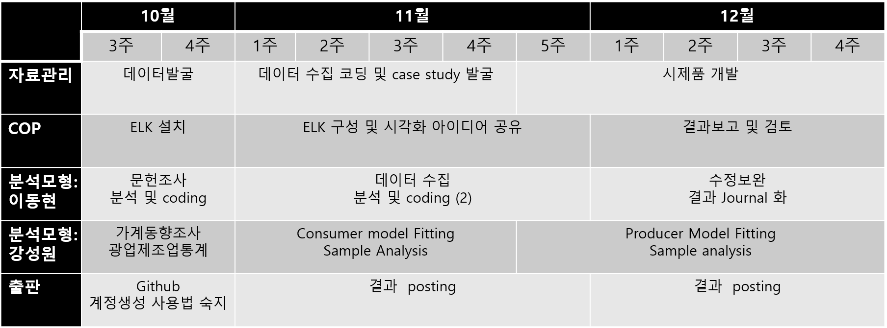

```{r setup, include=FALSE}
knitr::opts_chunk$set(echo = FALSE)
```

##Umbrella project : ' 환경 빅데이터 분석 및 서비스 개발'

- 연구내용
    + 환경 BigData 분석플랫폼 구축/환경정보개방 촉진방안 마련
    + 개인. 기업 등 이용자 대상 주기적 환경정보 서비스수요 분석
    + Data 기반 신환경서비스 산업생태계 창출
    + KEI 기반 새로운 공공 환경서비스 개발
- 3단계, 단계별 3년 계획
    + 1단계 (2017-19) 환경정보종합시스템 구축
    + 2단계 (2020-22) 환경정책 관련 사례연구를 통한 시스템 고도화 및 내실화
    + 3단계 (2023-25) 환경지식.정보 지원체계의 첨단화 및 대국민 서비스 활용도 제고


## What we do : '환경 Bigdata 분석 platform 구축'

- 우리는 환경관련  Data Journalism을 시작한다[분석].
    + FivethirtyEight benchmarking (http://fivethirtyeight.com/)

    
- 우리는 '환경정보종합시스템 구축'에 참여한다[Data].
    + Data journalism 의 부산물
    + 연구에 필요한 자료를 수집-추출하는 system을 구축한다.
    
## Data Journalism?
- Data Journalism = Empirical social science ON DEADLINE
    + 시의성 있는 주제를 선택한다
    + 정교하지만 해석은 가능한 분석도구를 이용하여 분석한다.
    + 주어진. 혹은 설정한 기간 내에 발신한다.
- 방법론은 정확하고, 신속하고, 투명하여야 한다.
    + 재생 가능한 연구 (reproducable research)를 지향한다.


http://blog.revolutionanalytics.com/2016/07/data-journalism-with-r-at-538.html

https://sec.ch9.ms/ch9/3543/cb72d91a-95b3-4950-aafb-2317901e3543/D1McCAWS11Flowers_mid.mp4


## 연구의 흐름
1. 주제 선정 : 4대 일간지 website webscraping + 자연언어분석
      + 초기: 기존 분석 서비스(Bigkinds) 활용 (http://www.bigkinds.or.kr/search/totalSearchMain.do)
      + 중장기: 자체 web scarping 기능 구추

2. 보고서 기획: 연구목적-내용-방법론 선정 

3. 자료 수집: 자료 수집 및 정리기능 자동화

4. 환경관련분석 : 오염도 추정 

5. 경제관련분석 : 일반균형 분석 및 부분균형 분석

6. 결론 및 시사점

## 발간방식[Report]
- 정기적 발신: Rmarkdown 이용 html 형태로 실시간 발신
    + data, analysis script, report script를 Github에 공개
    + 예: https://github.com/katto2/CleanCar
```{r cars}
y=(1:10)
x=sample(1:30.10, replace=TRUE)
d=data.frame(cbind(y,x))
prelim=lm(y~x,data=d)
prelim
prelim$coefficients
```

- 보고서 발신: 연 1회 정기발신을 모아서 연구소 보고서 양식으로 발간

## 발간주기[Report]
- 2017년 : 연 2회 (3-6, 7-10) + 1회 (11-2018.2)

- 2018년 : 연 4회 (분기 당) 

- 2019년 : 연 6회 (2개월 당) + 특별호 (부정기)

- 2020년 : 연 10회 (8월, 12월 제외) + 특별호 (부정기)

- 정기적 발건 주기 외에도 필요하다고 판단할 경우 특별호를 발간

## 발간방식[DB Platform]

- 정기발간물 reproducability 확보 과정의 성과 집적
    
- 원자료 확보 및 가공 과정을 자동화하여 연구의 편의를 확보
      + 확보: 존재하는 자료를 수집하는 과정을 자동화(Automated web scraping)
      + 가공: 원자료를 연구에 적합한 시간-공간 해상도를 가진 자료로 전환(imputation)

- (단기: 2017년 말)보고서 별 data를 집적한 meta db를 구축하여 website에 게시 (단기)
      + 예: https://github.com/fivethirtyeight/data
      
- (중장기: 2019년 말) meta db 의 집적, 추출 과정을 자동화하여 package 형태로 공개 (중기)
      + 예: R WDI package. FRED Excel Add-in
      


## 역할분담(잠정)
- 총괄: 장기복, 강성원
- 주제 선정: 추후 선정(채용?)
- 보고서 기획:  팀 전체 참여하고 팀장이 주재하는 편집회의
- 환경관련분석: 이동현/ Assist 김진형
- 경제관련분석: 강성원/ Assist 김도여
- 자료관리: 한국진/Assist 김도연  
- 출판: 김진형
- General Assistant: 김진형/김도여
- 행정: 최두연

## 당면과제 (Due to Dec. 2016)

- 분석 tool 구축: Deep Learning algorithm, 일반균형모형, 부분균형모형 
      + 강성원, 이동현

- 자료 관리 과정 구체화: source 파악, data scraping, storage, storage access.
      + 한국진

- 출판 process 구체화: homepage 개설, real time publication (desktop -> website), data  및 code publication. 
      + 김진형

- Sample Output : Deep Learning algorithm을 활용한 환경관련 분석 결과 소내 공개


## Action Plan
```{r, out.width = "800px"}

```


## 실원 교육 (2016 하반기-2017 1/4분기)

- COP meeting (2016년) : KEI 연구보고서 Access log data 분석
      + data analysis 분석 도구를 KEI 연구보고서 게시 page에 접속한 접속 log에 적용
      + KEI 보고서 수요자의 성향을 분석 
      + 성과가 좋을 경우 결과를 모아서 Sample output으로 활용
      + 운영: 한국진/Assist 김도연
      
- Workshop (2017 1/4분기): Data journalism에 필요한 skill 공유
      + R introductory course (https://sites.google.com/site/undergraduateguidetor/home)
      + 기초통계학
      + Publication: Rmarkdown + Web publication tools (Github,WordPress)
      + Project 단계별 과정 실습: 수집-분석-배포
      

## 부탁의 말씀

- slack 'Data Is Art' team 상시 접속 유지

- 일상적인 요청 및 제출은 Slack을 이용 (공문은 intranet 계속 이용)


- 아는 것 나누기
    + 예: http://blog.revolutionanalytics.com/